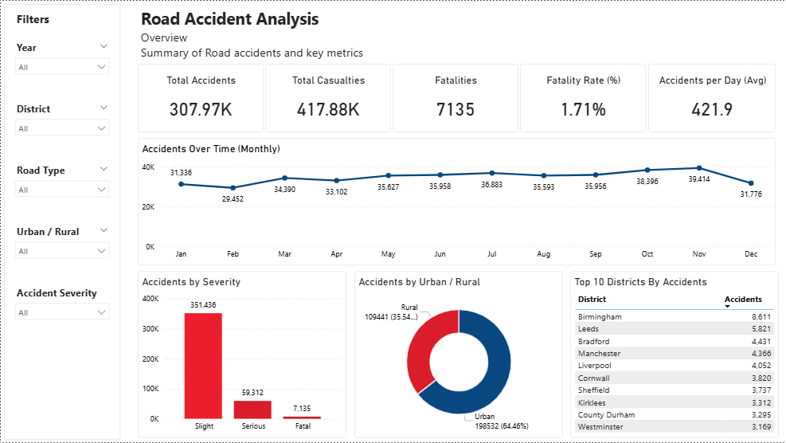
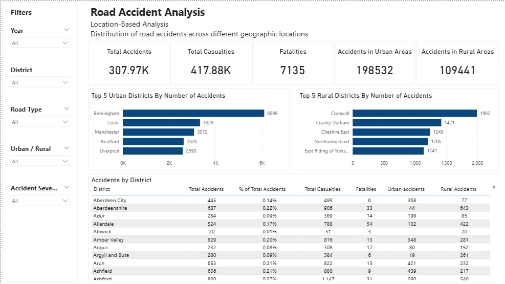
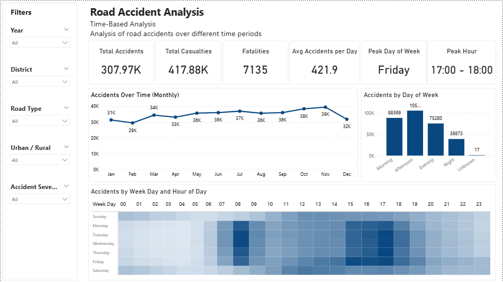
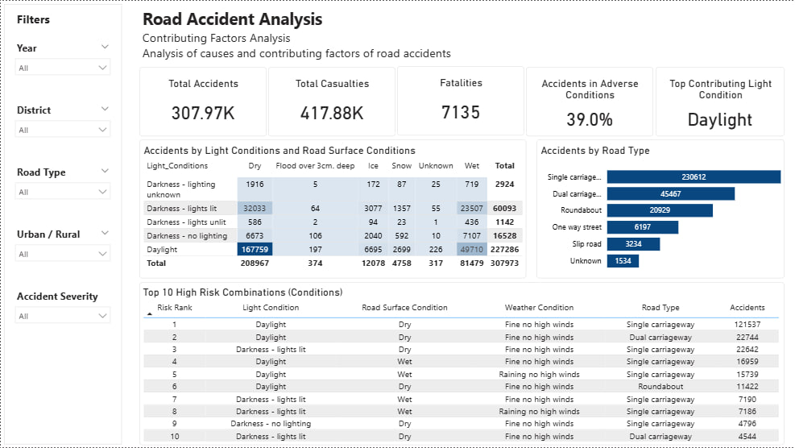

# Road Accident Analysis Report

## Overview

The **Road Accident Analysis Report** is an interactive Power BI project developed to analyze accident patterns, casualty severity, environmental conditions, and high-risk factors contributing to road accidents.

This report provides meaningful insights into:
- Accident trends over time
- High-risk locations
- Environmental and road conditions
- Casualty severity distribution
- Contributing accident factors

The goal of this project is to support data-driven road safety analysis and improve understanding of accident-prone scenarios using business intelligence techniques.

---

# Overview



# Location-Based



# Time-Based



# Contributing Factor



---

# Report Pages

## 1. Executive Overview
Provides a high-level summary of:
- Total Accidents
- Total Casualties
- Fatal Casualties
- Serious Casualties
- Slight Casualties
- Overall accident trends

---

## 2. When Accidents Occur
Time-based analysis including:
- Year-wise accident trends
- Monthly accident patterns
- Day vs Night accidents
- Peak accident timings

---

## 3. Where Accidents Occur
Location-based insights including:
- Urban vs Rural accidents
- Road type analysis
- High-risk accident areas

---

## 4. Why Accidents Occur
Contributing factor analysis including:
- Weather conditions
- Road surface conditions
- Light conditions
- High-risk condition combinations

---

# Objectives

- Analyze road accident trends and patterns
- Identify major contributing factors behind accidents
- Study casualty severity distribution
- Detect high-risk road and environmental conditions
- Build an interactive and insightful Power BI report

---

# Features

## Interactive Filters
- Year Selection
- Road Type Filters
- Area Filters
- Environmental Condition Filters

## KPI Cards
- Total Accidents
- Total Casualties
- Fatal Casualties
- Serious Casualties
- Slight Casualties

## Dynamic Visualizations
- Trend Analysis
- Severity Analysis
- Weather Condition Analysis
- Road Surface Analysis
- Location-Based Insights

## User-Friendly Design
- Clean report structure
- Interactive slicers
- Responsive visual elements
- Easy-to-understand analytics

---

# Tools & Technologies Used

| Tool | Purpose |
|------|----------|
| Power BI | Report Development |
| DAX | Calculated Measures & KPIs |
| Power Query | Data Cleaning & Transformation |
| Excel / CSV | Dataset Source |

---

# Dataset Information

The dataset contains:
- Accident Date
- Accident Severity
- Casualties
- Weather Conditions
- Road Surface Conditions
- Light Conditions
- Road Type
- Urban/Rural Area Information

---

# Key Insights

- Most accidents occurred during low-light conditions.
- Wet and poor road surface conditions contributed significantly to accident frequency.
- Urban areas reported a higher number of accidents compared to rural areas.
- Certain weather and lighting combinations showed increased accident severity.

---

# Project Structure

```text
Road-Accident-Analysis/
│
├── Dashboard/
│   └── Road_Accident_Analysis_Report.pbix
│
├── Dataset/
│   └── Measure_Table.xlsx
│   └── Road_Accident.csv
│
├── Screenshots/
│   ├── overview.jpg
│   ├── Contributing Factor Analysis.jpg
│   ├── Location-Based Analysis.jpg
│   └── Time-Based Analysis.jpg
│
├── README.md
```

---

# How to Use

## Step 1
Clone the repository

```bash
git clone https://github.com/your-username/road-accident-analysis.git
```

## Step 2
Open the `.pbix` file using **Power BI Desktop**

## Step 3
Explore the report using filters and slicers

---

# Skills Demonstrated

- Data Cleaning
- Data Transformation
- Data Modeling
- DAX Calculations
- Business Intelligence Reporting
- Data Visualization
- Analytical Thinking
- Insight Generation

---

# Future Enhancements

- Predictive accident hotspot detection
- Real-time traffic data integration
- AI-based accident risk prediction
- GIS map integration
- Advanced trend forecasting

---

# Author

## Aadesh Gupta

Power BI Developer | Data Analytics Enthusiast

---

# Repository Topics

`powerbi` `dashboard` `road-accident-analysis` `business-intelligence` `data-analysis` `analytics` `dax` `data-visualization` `road-safety`